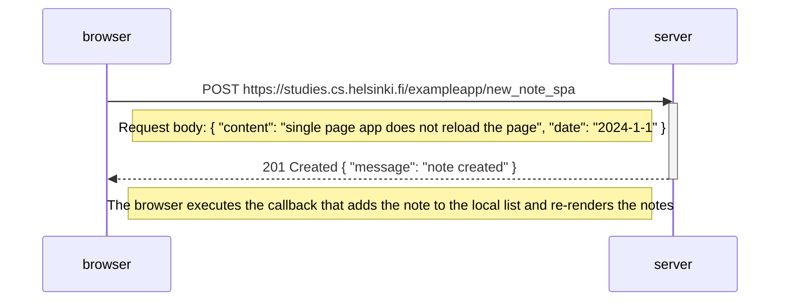

```mermaid
sequenceDiagram
    participant browser
    participant server

    browser->>server: POST https://studies.cs.helsinki.fi/exampleapp/new_note_spa
    activate server
    Note left of server: Request body: { "content": "single page app does not reload the page", "date": "2024-1-1" }
    server-->>browser: 201 Created { "message": "note created" }
    deactivate server

    Note right of browser: The browser executes the callback that adds the note to the local list and re-renders the notes
```
